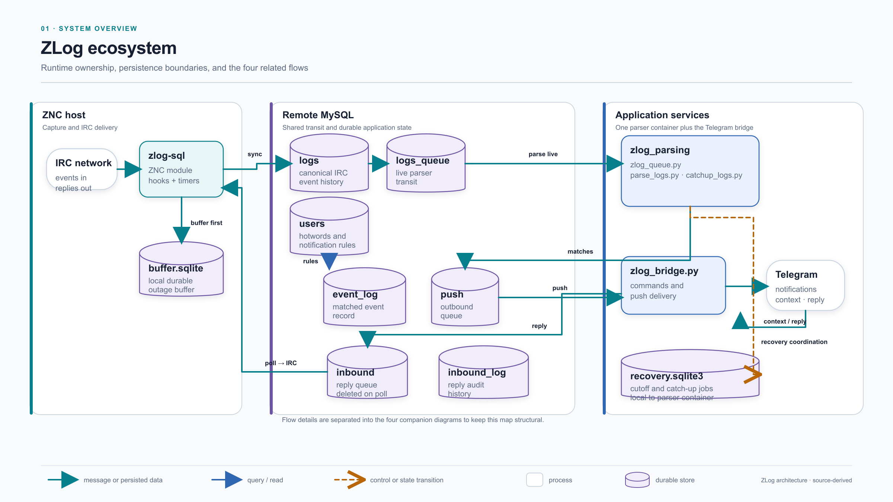
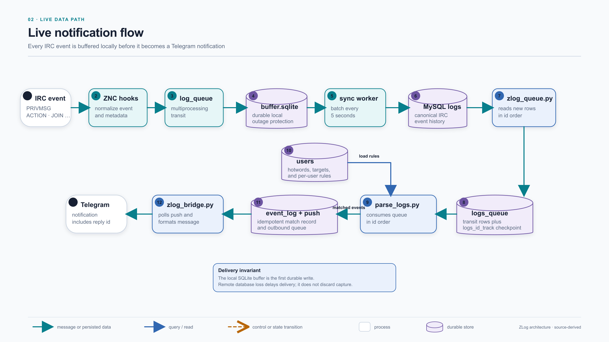
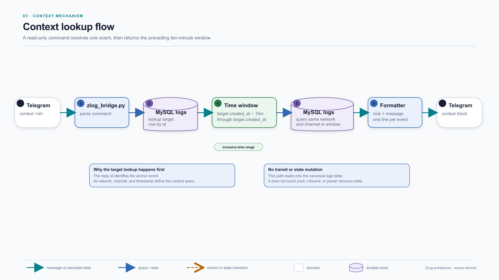
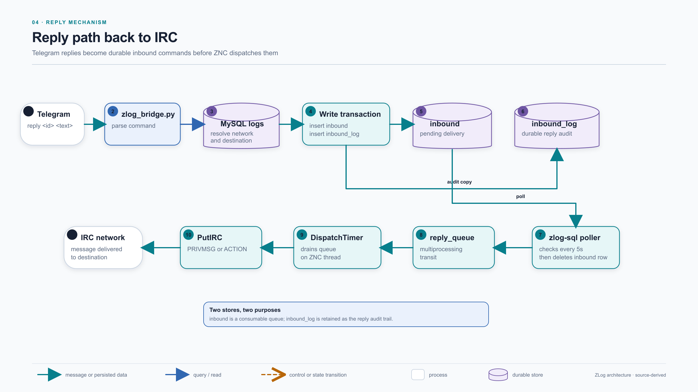
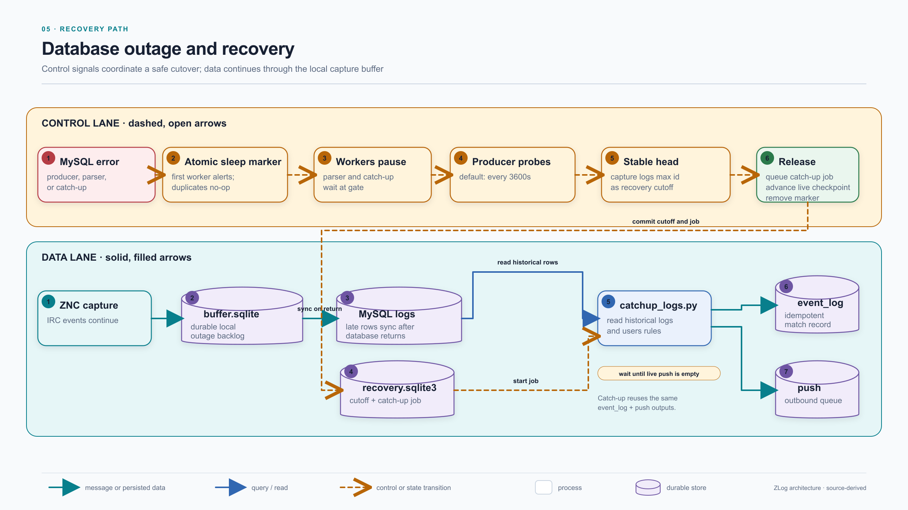

# ZLog architecture

These diagrams describe the current runtime relationships between `zlog-sql`, `zlog_parsing`, `zlog_telegram`, ZNC, IRC, Telegram, and their storage and transit layers.

## Notation

- Solid teal arrows represent messages or persisted data.
- Solid blue arrows represent queries and reads.
- Dashed amber arrows with open heads represent control signals and state transitions.
- Rounded rectangles represent running processes or external systems.
- Cylinders represent durable stores.

## Diagrams

### 1. System overview

Repository and deployment ownership, shared storage, and the relationships between the four runtime flows.

[Editable SVG](01-zlog-system-overview.svg)

### 2. Live notification flow

IRC capture, local buffering, remote synchronization, live parsing, and Telegram notification delivery.

[Editable SVG](02-live-notification-flow.svg)

### 3. Context lookup flow

The read-only `context <id>` path and its inclusive ten-minute lookup window.

[Editable SVG](03-context-flow.svg)

### 4. Reply path

The durable path from `reply <id> <text>` in Telegram through `inbound`, the ZNC queues, and back to IRC.

[Editable SVG](04-reply-flow.svg)

### 5. Database recovery

The MySQL failure trigger, shared recovery coordination, live cutover, local buffering, and catch-up processing. Control signals are deliberately separated from replayed data.

[Editable SVG](05-recovery-flow.svg)
